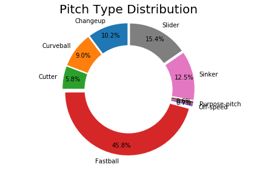
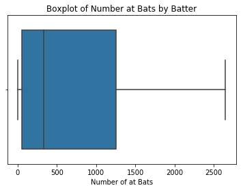
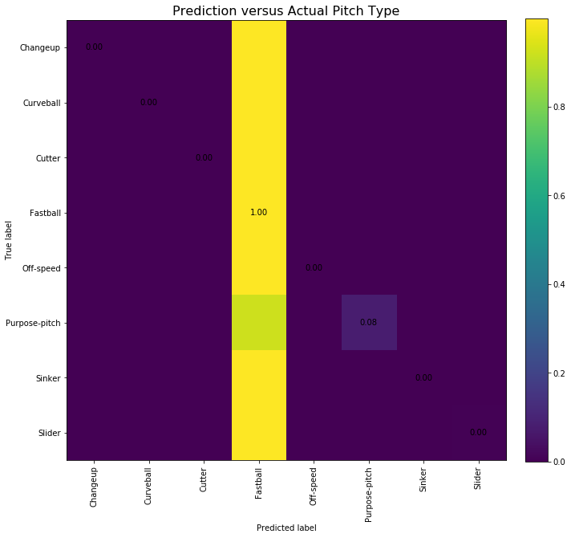

# Predicting the Next Pitch: A Statistical Analysis


> “Baseball is like church. Many attend, few understand.”
- Leo Durocher

The purpose of this assigment is to predict the type of pitch in real time. 

First, it is important to get a general understanding of various factors that a pitcher may consider when deciding upon his subsequent pitch. As someone who doesn't closely follow the baseball scene, I referred to this Quora post as the basis for my initial EDA and feature selction. https://www.quora.com/Why-does-a-pitcher-choose-a-specific-pitch-to-throw

To summarize, the following were listed as factors:

1. Strength of opposing hitters. The author notes high pitches are thrown less frequently against power hitters. 
2. Count. The author notes that if the pitcher is behind in count, he is more likely to throw a simple pitch to increase the likelihood of a strike.
3. Situation. The author notes the score, the number of outs, the position of the baserunners are three situational factors that would affect the type of pitch.

<i> It's interesting to note that the author does not identify pitcher tendency/history nor fatigue as factors of pitch selection. </i>
<i> Furthermore, from a sports psychology perspective, it is likely that the likelihood of pitches are not completely independent of the previous pitches. I would like to investigate the autocorrelation of pitch history given more time. </i>


```python
import numpy as np
import pandas as pd
import seaborn as sns
from matplotlib import pyplot as plt
```


```python
import warnings
warnings.filterwarnings('ignore')
```


```python
df = pd.read_csv('pitches/pitches.txt', sep=",")
```

### 1. Exploratory Data Analysis

First, let us perform EDA on this dataset. For the sake of readability, I have collapsed this below. Our target variable, pitch_type, has 2280 null observations in a dataset of 718961, ~0.3%. This is an accept percentage of null values to remove from the data set as long as there is no inherent underlying factor. It does seem that the null set does not specifically pertain to one team, pitcher, batter or date.


```python
df.shape;
df.head();
df.info();
df.describe();
```

    <class 'pandas.core.frame.DataFrame'>
    RangeIndex: 718961 entries, 0 to 718960
    Columns: 125 entries, uid to modified_by
    dtypes: float64(80), int64(25), object(20)
    memory usage: 685.7+ MB
    


```python
a = len(set(df.team_id_b))
b = len(set(df.team_id_p))
c = len(set(df.pitcher_id))
d = len(set(df.date))
print('The number of teams @ bat, teams @ field, pitchers, and dates represented in the entire dataset: ', a, b, c, d)
```

    The number of teams @ bat, teams @ field, pitchers, and dates represented in the entire dataset:  30 30 662 203
    


```python
a = len(set(df[df.pitch_type.isnull()].team_id_b))
b = len(set(df[df.pitch_type.isnull()].team_id_p))
c = len(set(df[df.pitch_type.isnull()].pitcher_id))
d = len(set(df[df.pitch_type.isnull()].date))
print('The number of teams @ bat, teams @ field, pitchers, and dates represented in the nullset: ', a, b, c, d)
```

    The number of teams @ bat, teams @ field, pitchers, and dates represented in the nullset:  30 30 396 185
    


```python
df = df.drop(df[df.pitch_type.isnull()].index, axis = 0)
```

##### 1a. Splitting Data into training sets

We will use K-Fold validation later so we do not need to further split a data set to validate upon. Furthermore, it's good practice to not use future data to predict upon past data, but for especially for the purposes of this assignment, since we are trying to build a real-time prediction model.


```python
print('The number of days that games were played on: ', len(set(df.date)))
```

    The number of days that games were played on:  203
    


```python
df.date = pd.to_datetime(df.date)
cutoffDate = pd.to_datetime('2011-09-01')
```


```python
print('The number of observations total, before the cutoff date, and on or after are: \n')
print(len(df), ',', len(df[df.date<cutoffDate]), ',' , len(df[df.date>=cutoffDate]))
```

    The number of observations total, before the cutoff date, and on or after are: 
    
    716681 , 589094 , 127587
    

I've selected September 1st as the cutoff date for separating our dataset. Generally 15%~30% of the dataset is kept for testing.


```python
print('The percentage of data in of training set is: ', round(len(df[df.date<cutoffDate])/len(df),2))
```

    The percentage of data in of training set is:  0.82
    


```python
train = df[df.date<cutoffDate]
test = df[df.date>=cutoffDate]
```

##### 1a. Exploring the Target Variable

Let's investigate the types of pitches in the our training dataset.


```python
print(set(train.pitch_type))
```

    {'FC', 'SC', 'KC', 'SI', 'EP', 'CU', 'FF', 'FT', 'CH', 'FS', 'FA', 'FO', 'IN', 'KN', 'SL', 'PO', 'UN', 'AB'}
    

There are 18 labels in our dataset, which are abbrevations for various pitches. Using this as a reference, https://library.fangraphs.com/pitch-type-abbreviations-classifications/, I've combined several pitches together. This will help improve model performance later on. I've also dropped the 14 unindentified pitches.


```python
print('The number of unidentified pitches are: ', len(train[train['pitch_type'] == 'UN']))
```

    The number of unidentified pitches are:  14
    


```python
def remove_unindentified(df):
    df = df.drop(df[df['pitch_type'] == 'UN'].index, axis = 0)
    return df
```


```python
train = remove_unindentified(train)
```


```python
pitch_catg = {'FF': 'Fastball',
              'SL': 'Slider',
              'CU': 'Curveball',
              'SI': 'Sinker',
              'FC': 'Cutter',
              'FT': 'Fastball',
              'KC': 'Curveball',
              'CH': 'Changeup',
              'IN': 'Purpose-pitch',
              'KN': 'Off-speed',
              'FS': 'Fastball',
              'FA': 'Fastball',
              'PO': 'Purpose-pitch',
              'EP': 'Off-speed',
              'SC': 'Off-speed',
              'AB': 'Purpose-pitch',
              'FO': 'Changeup'}
```


```python
def convert_pitch(row):
    return pitch_catg[row['pitch_type']]
    
def transform_target(df):
    df.loc[:, 'pitch_type'] = df.apply(convert_pitch, axis = 1)
    return df
```


```python
transform_target(train);
```

Great, now we have eight types of pitches we can work with!


```python
percentages = (train.groupby('pitch_type').count()['uid']/len(train))
labels = percentages.index
sizes = percentages

explode = (0.05,0.05,0.05,0.05,0.05,0.05,0.05,0.05)
plt.pie(sizes, labels=labels, autopct='%1.1f%%', startangle=90, pctdistance=0.85, explode = explode)

centre_circle = plt.Circle((0,0),0.70,fc='white')
fig = plt.gcf()
fig.gca().add_artist(centre_circle)

# Equal aspect ratio ensures that pie is drawn as a circle
plt.title('Pitch Type Distribution', size = 20)
plt.axis('equal')
plt.tight_layout()
plt.show()
```





```python
train.pitch_type.value_counts()
```


    Fastball         269677
    Slider            90621
    Sinker            73720
    Changeup          60379
    Curveball         53039
    Cutter            33978
    Off-speed          3941
    Purpose-pitch      3725
    Name: pitch_type, dtype: int64


While our dataset is imbalanced, we have a good sample of data for each class, so it doesn't appear like we need to use minority oversampling techniques like SMOTE to more acccurately achieve minority class representation.

##### 1b. Selecting an Error Metric

How are we evaluating the performance of our model? 

Well, this depends on our objective. If it was simply correctly predicting the next pitch as often as possible, a simple baseline model could just be always predicting the majority class, 'Fastball', with an accuracy of ~46%. If we care about the confidence with which we make our prediction, perhaps a measurement like Log Loss is superior.

> Model Log Loss = $\sum_{i=1}^{N} p_i log(p_i)$

##### 1c. Feature Engineering

Once again, these are the features that we want to investigate. <i> With more time and computational power, I would test more features and iteratively removing the feature that had the least impact on model prediction.</i>

1. Strength of opposing hitters. The author notes high pitches are thrown less frequently against power hitters. 

Though imperfect, we will define the power hitting variable as number of doubles, triples and homerun that a runner has hit, divided by the total at bats less non-outs/hits events. 

>$powerHitting = (doubles + triples + homeruns) \% (atBats - otherResults)$


```python
set(train.event)
```


    {'Batter Interference',
     'Bunt Groundout',
     'Bunt Lineout',
     'Bunt Pop Out',
     'Catcher Interference',
     'Double',
     'Double Play',
     'Fan interference',
     'Field Error',
     'Fielders Choice',
     'Fielders Choice Out',
     'Flyout',
     'Forceout',
     'Grounded Into DP',
     'Groundout',
     'Hit By Pitch',
     'Home Run',
     'Intent Walk',
     'Lineout',
     'Pop Out',
     'Runner Out',
     'Sac Bunt',
     'Sac Fly',
     'Sac Fly DP',
     'Single',
     'Strikeout',
     'Strikeout - DP',
     'Triple',
     'Triple Play',
     'Walk'}


We define otherResults as results that do not reflect an batter's ability to hit the ball, and are include in the set below.


```python
powerHits = {'Double','Triple', 'Home Run'}
```


```python
otherResults = {'Batter Interference'.lower(), 'Batcher Interference'.lower(), 
                'Fan Interference'.lower(), 'Field Error'.lower(),
                'Hit By Pitch'.lower(), 'Intent Walk'.lower(), 'Walk'.lower()}
```


```python
train['powerHits'] = [x in powerHits for x in train.event]
train['otherResults'] = [x.lower() in otherResults for x in train.event]
```


```python
print('The total number of at bats in our training set (less otherResults) is :', len((train[(train.is_final_pitch == 1) & (train.otherResults == 0)])))
```

    The total number of at bats in our training set (less otherResults) is : 139491
    


```python
print('The total number of at bats in which a power hit is achieved in our training set is :', len(train[(train.is_final_pitch == 1) & (train.powerHits == 1)]))
```

    The total number of at bats in which a power hit is achieved in our training set is : 11439
    


```python
print('The league power hitting percentage is: ', round(11439/139493,3))
```

    The league power hitting percentage is:  0.082
    

**At this point, we note that we will only use the data from the training set to predict upon the test set. Although a more accuracy model can be achieve by also using early test data to predict upon subsequent set data, re-training our model after each observation may be too computationally expensive for the limit in time and scope of this project.**


```python
def addPowerHittingLeague(df):
    df['powerHittingLeague'] = (11439/139493)
    return df
```


```python
addPowerHittingLeague(train);
```

Next, we calculate the individual power hitting statistic of each individual batter.


```python
temp = train[train.is_final_pitch == 1]
temp = temp[temp.otherResults == 0]
indPowerHitDict = (temp.groupby('batter_id').mean().powerHits).to_dict()
```


```python
temp = train[train.is_final_pitch == 1]
temp = temp[temp.otherResults == 0]
numAtBats = (temp.groupby('batter_id').count().uid).to_dict()
```


```python
def addPowerHittingIndividual(df):
    df['powerHittingInd'] = [indPowerHitDict[x] if x in indPowerHitDict else (11439/139493) for x in df.batter_id]
    return df
```


```python
def addNumAtBats(df):
    df['numAtBats'] = [numAtBats[x] if x in numAtBats else 0 for x in df.batter_id]
    return df
```


```python
addPowerHittingIndividual(train);
addNumAtBats(train);
```


```python
sns.boxplot(train.groupby('batter_id').uid.count())
plt.xlabel('Number of at Bats')
plt.title('Boxplot of Number at Bats by Batter')
```


    Text(0.5,1,'Boxplot of Number at Bats by Batter')





```python
pd.Series(train.groupby('batter_id').uid.count()).value_counts().sort_index();
```

It does seems that the majority of the 800+ batters do have >5+ at bat attempts in the training set. However, it does seem that for batters with few attempts that the binary estimation of the powerHitting variable can have high variance. Consequently, let us introduce a normalization factor. Where we estimate a batter's true powerhitting percentage as a weighted average of the individual powerhitting percentage and the league's powerhitting percentage.

>$powerHittingComb = (powerHittingInd*numAtBats + powerHittingLeague*10) \% (numAtBats+10)$


```python
def addPowerHittingComb(df):
    df['powerHittingComb'] = (df.powerHittingInd*df.numAtBats + df.powerHittingLeague*10)/(df.numAtBats+10)
    return df
```


```python
addPowerHittingComb(train);
```

2. Count. The author notes that if the pitcher is behind in count, he is more likely to throw a simple pitch to increase the likelihood of a strike.

Someone who understands baseball better than me may be able to map various counts to a single variable indicating the necessity/propensity for a pitcher to strike. Here, I will simply create 12 columns of boolean variables, each indicating whether or not the count is that specific count.


```python
def addCount(df):
    df['0and0'] = (df.balls == 0) & (df.strikes == 0)
    df['0and1'] = (df.balls == 0) & (df.strikes == 1)
    df['0and2'] = (df.balls == 0) & (df.strikes == 2)
    df['1and0'] = (df.balls == 1) & (df.strikes == 0)
    df['1and1'] = (df.balls == 1) & (df.strikes == 1)
    df['1and2'] = (df.balls == 1) & (df.strikes == 2)
    df['2and0'] = (df.balls == 2) & (df.strikes == 0)
    df['2and1'] = (df.balls == 2) & (df.strikes == 1)
    df['2and2'] = (df.balls == 2) & (df.strikes == 2)
    df['3and0'] = (df.balls == 3) & (df.strikes == 0)
    df['3and1'] = (df.balls == 3) & (df.strikes == 1)
    df['3and2'] = (df.balls == 3) & (df.strikes == 2)
    return df
```


```python
addCount(train);
```

3. Situation. The author notes the score, the number of outs, the position of the baserunners are three situational factors that would affect the type of pitch.
<i> It makes sense to me just to look at the score differential, though in some edge cases the absolute score can be important in determining the pitch type (for example, if the score was 0-0, the pitch might be more incline to throw a more difficult pitch to try to get a 'perfect' game.)


```python
def addScore(df):
    df['netScore'] = (df.home_team_runs - df.away_team_runs)*(df.top-0.5)*2
    return df
```

The numbers of outs is already provided in the data set. The position of runner is an interesting feature to consider. For this project, I won't consider the idiosyncratic nature of the runner, but pitchers can potentially be more inclined to throw trickey pitches when faster runners are on base. Although there is no direct measure of speed, provided in the dataset, we can easily find the number of steals statistic online and use that as a proxy for runner speed. In this project, we will just look at the position of runner as boolean variables of whether or not a runner exists on first, second and/or third.


```python
def addOnBase(df):
    df['1b'] = 1-df.on_1b.isnull()
    df['2b'] = 1-df.on_2b.isnull()
    df['3b'] = 1-df.on_3b.isnull()
    return df
```


```python
addOnBase(train);
```

We shouldn't need a cross product of these variables, since our model should capture the non linear relationship of our data. And ... that's it! All the features that we want to use for the first iteration of our model have been created. The function below is just repeating what did above, summarizing it into one function.


```python
def dataPipeline(df):
    'Objective: Perform feature transformation, feature selection'
    'Input: Our entire dataset'
    'Output: X, our reduced feature matrix, and y our target vector'
    df = remove_unindentified(df)
    df = transform_target(df)
    df = addPowerHittingLeague(df)
    df = addPowerHittingIndividual(df)
    df = addNumAtBats(df)
    df = addPowerHittingComb(df)
    df = addCount(df)
    df = addScore(df)
    df = addOnBase(df)
    y = df.pitch_type
    X = df[['powerHittingComb','0and0','0and1','0and2','1and0','1and1','1and2',
            '2and0','2and1','2and2', '3and0', '3and1', '3and2', 'outs','netScore','1b','2b','3b']]
    return X,y
```

We rerun everything here.


```python
df = pd.read_csv('pitches/pitches.txt', sep=",")
df.date = pd.to_datetime(df.date)
df = df.drop(df[df.pitch_type.isnull()].index, axis = 0)
cutoffDate = pd.to_datetime('2011-09-01')
train = df[df.date<cutoffDate]
test = df[df.date>=cutoffDate]
```


```python
X_train, y_train = dataPipeline(train)
```


```python
X_test, y_test = dataPipeline(test)
```

### 2. Modeling


```python
from sklearn.linear_model import LogisticRegression
from sklearn.ensemble import RandomForestClassifier
from sklearn.preprocessing import StandardScaler
from sklearn import svm
from sklearn.naive_bayes import MultinomialNB
from sklearn.model_selection import cross_validate, GridSearchCV
from sklearn.model_selection import KFold
from sklearn import metrics
from sklearn.metrics import confusion_matrix, classification_report
import pickle
```

Next, we run our data through various models to see which model works the best, and figure out which parameters work the best. Due to time contraints, I couldn't do everything I wanted here, like the model parameter optimization using GridSearch, or implementing more complicated cost functions to better evaluate our model. **Note: The model fitting take a very long time**

<i>Some of the code here is reused from a previous project that I did</i>.

We have chose to look at the performance of a logistic model, a svm model, a naive bayes model, and a random forest model.

##### 2a. Logistic Model:


```python
def logistic_test(X_train,X_test,y_train,y_test):
    """
    Inputs: X is the matrix of explanatory variables, y is the vector of target variables
    Function: Fits a logistic regression. Tunes parameters. Prints out the accuracy for best parameter. Pickles the model with the best accuracy result.	
    Outputs: The model predicted activity
    """
    crange = [0.01,0.1,1,10,100] # Tuning parameters
    acc_scr = []

    for num in crange:
        model = LogisticRegression(C=num,solver='liblinear',max_iter = 5000,multi_class='auto')
        model.fit(X_train, y_train)
        y_pred = model.predict(X_test)
        mas = metrics.accuracy_score(y_test,y_pred)
        acc_scr.append(mas)

    max_idx = max(range(len(acc_scr)), key=acc_scr.__getitem__)
    best_model = LogisticRegression(C=crange[max_idx],solver='liblinear',max_iter = 5000,multi_class='auto')
    best_model.fit(X_train, y_train)
    y_pred = best_model.predict(X_test)
    print ('Logistic Test Accuracy: ', metrics.accuracy_score(y_test,y_pred))

    with open('model/logistic.pickle', 'wb') as handle:
        pickle.dump(best_model, handle, protocol=pickle.HIGHEST_PROTOCOL)

    return y_pred
```


```python
logistic_test(X_train,X_test,y_train, y_test)
```

    Logistic Test Accuracy:  0.47514578630549287
    

The Logistic Test Accuracy is 47.15%, only marginally better than our baseline!

##### 2b. SVM model


```python
def svm_test(X_train,X_test,y_train, y_test):
    """
    Inputs: X is the matrix of explanatory variables, y is the vector of target variables
    Function: Fits a Support Vector Machine learning model. Tunes parameters. Prints out the accuracy for best parameter. Pickles the model with the best accuracy result.	
    Outputs: None
    """
    crange = [0.01,0.1,1,10,100] # Tuning parameters
    acc_scr = []
    
    for num in crange:
        model = svm.LinearSVC(C=num)
        model.fit(X_train, y_train)
        y_pred = model.predict(X_test)
        mas = metrics.accuracy_score(y_test,y_pred)
        acc_scr.append(mas)

    max_idx = max(range(len(acc_scr)), key=acc_scr.__getitem__)
    best_model = svm.LinearSVC(C=num)
    best_model.fit(X_train, y_train)
    y_pred = best_model.predict(X_test)
    print ('SVM Test Accuracy: ', metrics.accuracy_score(y_test,y_pred))

    with open('model/svm.pickle', 'wb') as handle:
        pickle.dump(best_model, handle, protocol=pickle.HIGHEST_PROTOCOL)

    return None
```


```python
# svm_test(X_train,X_test,y_train,y_test)
# This takes too long to run
```

##### 2c. Naive Bayes model:


```python
def nb_test(X_train,X_test,y_train, y_test):
    """
    Inputs: X is the matrix of explanatory variables, y is the vector of target variables
    Function: Fits a Naive Bayes model. Pickles the model. Prints accuracy result.	
    Outputs: None
    """
    model = MultinomialNB()
    model.fit(X_train, y_train)
    y_pred = model.predict(X_test)
    print ('NB Test Accuracy: ', metrics.accuracy_score(y_test,y_pred))

    with open('model/nb.pickle', 'wb') as handle:
        pickle.dump(model, handle, protocol=pickle.HIGHEST_PROTOCOL)

    return None
```


```python
# nb_test(X_train,X_test,y_train, y_test)
# This takes too long to run
```

##### 2d. Random Forest model


```python
def rf_test(X_train,X_test,y_train, y_test):
    """
    Inputs: X is the matrix of explanatory variables, y is the vector of target variables
    Function: Fits a Random Forest model. Pickles the model. Prints accuracy result.	
    Outputs: None
    """
    scaler = StandardScaler()
    scaler.fit(X_train)
    X_std = scaler.transform(X_train)
    X_test_std = scaler.transform(X_test)

    rf_model = RandomForestClassifier(n_estimators = 100, random_state = 0, n_jobs=-1)
    rf_model.fit(X_train, y_train)
    y_pred = rf_model.predict(X_test)
    print ('Random Forest Test Accuracy: ', metrics.accuracy_score(y_test,y_pred))

    with open('model/rf.pickle', 'wb') as handle:
        pickle.dump(rf_model, handle, protocol=pickle.HIGHEST_PROTOCOL)

    return None
```


```python
rf_test(X_train, X_test, y_train, y_test)
```

    Random Forest Test Accuracy:  0.3403404815650865
    

Wow, this wasn't very good, perhaps we needed to select better parameters.


```python
def rf_test2(X_train,X_test,y_train, y_test):    
    """
    Inputs: X is the matrix of explanatory variables, y is the vector of target variables
    Function: Fits a Random Forest model. Pickles the model. Prints accuracy result.	
    Outputs: None
    """
    scaler = StandardScaler()
    scaler.fit(X_train)
    X_std = scaler.transform(X_train)
    X_test_std = scaler.transform(X_test)
    rfc=RandomForestClassifier(random_state=42)
    param_grid = { 
        'n_estimators': [25, 100, 250],
        'max_features': ['auto','sqrt'],
        'max_depth' : [4,6,8],
    }
    
    CV_rfc = GridSearchCV(estimator=rfc, param_grid=param_grid, cv = 5)
    CV_rfc.fit(X_train, y_train)
    y_pred = CV_rfc.predict(X_test)
    print ('Random Forest Test Accuracy: ', metrics.accuracy_score(y_test,y_pred))
    
    with open('model/rf.pickle', 'wb') as handle:
        pickle.dump(rf_model, handle, protocol=pickle.HIGHEST_PROTOCOL)

    return y_pred
```


```python
# rf_test2(X_train, X_test, y_train, y_test);
# This also takes too long to run!
```

###### 2e. Visualizing result using a confusion matrix


```python
def plot_confusion_matrix(cm, col, title, cmap=plt.cm.viridis):
    """
    Inputs: cm is the columns, col is the target, title is used for plot, cmap is the color scheme (default set as ocean)
    Function: Plots the confusion matrix
    Outputs: None 
    """
    plt.imshow(cm, interpolation='nearest', cmap=cmap)
    for i in range(cm.shape[0]):
        plt.annotate("%.2f" %cm[i][i],xy=(i,i),
                    horizontalalignment='center',
                    verticalalignment='center')
    plt.title(title,fontsize=16)
    plt.colorbar(fraction=0.046, pad=0.04)
    tick_marks = np.arange(len(col.unique()))
    plt.xticks(tick_marks, sorted(col.unique()),rotation=90)
    plt.yticks(tick_marks, sorted(col.unique()))
    plt.tight_layout()
    plt.ylabel('True label',fontsize=10, labelpad=-10)
    plt.xlabel('Predicted label',fontsize=10)
```

Let's use a Logistic Regression because it's the least expensive computationally.


```python
y_pred = logistic_test(X_train, X_test, y_train, y_test)
cm = confusion_matrix(y_test, y_pred)
np.set_printoptions(precision=2)
cm_normalized = cm.astype('float') / cm.sum(axis=1)[:, np.newaxis]
```


```python
plt.figure(figsize=(10,12))
plot_confusion_matrix(cm_normalized, y_test,title='Prediction versus Actual Pitch Type')
```





It looks at the moment that the model is only predicting 'Fastballs' and 'Purpose Pitchs'. There's not enough incentive for the model to deviate from the 'Fastball' prediction, except in some scenarios where a 'Purpose Pitch' is more likely. 

### 3. Future Improvements

Right now, our limitation is still computational efficiency. Retraining our model on ~80% of 1 years' worth of data still takes a significant amount of time on a modern laptop. We can partially alleviate this issue by employing multiple instances of AWS EC2, since the workflow of some models (like Random Forest) are parallelizable. Alternatively, we can employee our own 

We can increase the accuracy of our result by optimizing our model parameters (again, this would take more computational power). We can also increase our model by implementing more features or more accurately engineered features.

The measure of success is also heavily dependent on your objective. Often a simple accuracy score doesn't capture the entire story. We can use various other accuracy metrics like AUC-ROC score, F1 score, etc, to get a better representation of our entire confusion matrix. Other loss metrics like Log Loss are not simple classfication model, but have an associated predicted probability with each outcome, and unlikely outcomes are more heavily punished if the model underweights its probability. However in the context of market making and sportsbetting, it might make to sense to employ this loss metric.

**Thanks for reading! I had a lot of fun doing this project **

